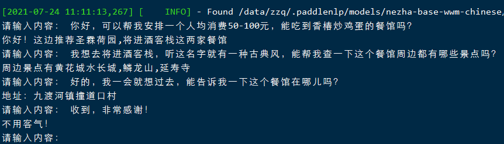
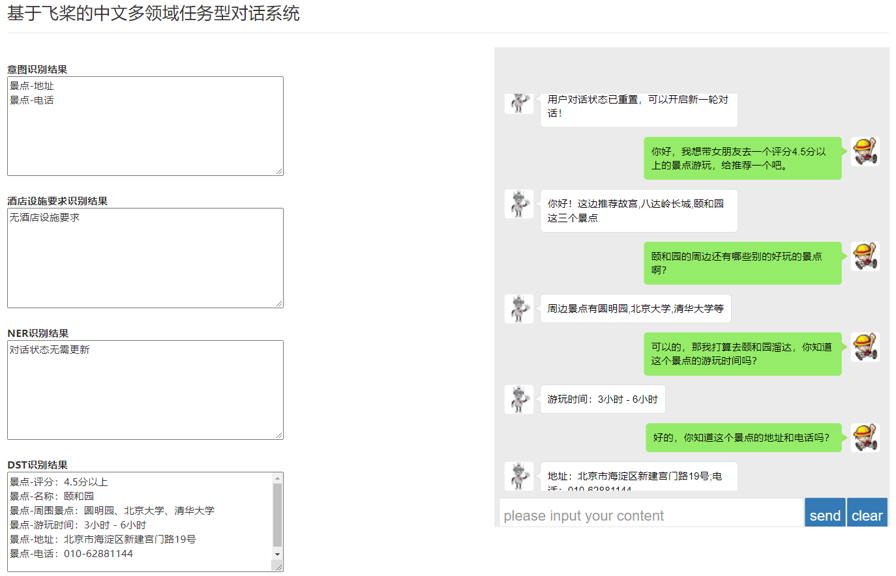

# TDS

## 运行方式一：Colab（优点：环境部署简单快速，缺点：无法进行网页端查看,得翻墙）
#### Covlab地址
https://drive.google.com/drive/folders/1xaW472DaLdA7OjwXQzUnm0qs-M9FEqo-?usp=sharing  
克隆到自己云盘，运行notebook即可

## 运行方式二：本地运行
#### 环境要求
- python=3.6  

（网页部署环境要求：``pip3 install flask flask-cors``）

#### 预训练权重下载地址
- 百度网盘链接：https://pan.baidu.com/s/17fCpfkQodHvQEOLinrkG-Q
- 提取码：hg3r

- 备用权重
  - 百度网盘：https://pan.baidu.com/s/1zqM70hUM8TaLDW0q0-pZ9w
  - 提取码：57sp  

下载好放在根目录下即可

#### 运行对话系统
``python main.py``

#### 网页端部署
``python api.py``,然后进入PaddleContextWeb，右键default.html用浏览器打开

## License
Apache License 2.0
